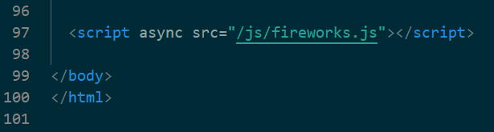

### 路径提示

因Hexo安装主题有两种方式，所以存放自定义资源的位置也不同，但总结为以下两种路径

> npm 安装的主题：博客路径\node_modules\hexo-theme-fluid
>
> git clone 安装的主题：博客路径\themes\fluid

本文所有特效需要添加或修改的文件都在以上其中之一路径下，本文演示为npm安装方式

### 鼠标礼花特效

特效演示


将[fireworks.js](https://cnwjy.site/js/fireworks.js)放入以下路径中（自行下载或新建并粘贴保存）

> 博客路径\node_modules\hexo-theme-fluid\source\js

添加代码至**layout.ejs**文件

``` ejs
<!--文件路径-->
博客路径\node_modules\hexo-theme-fluid\layout\layout.ejs

<!--添加代码-->
<!--鼠标点击礼花特效-->
<script async src="/js/fireworks.js"></script>
```

演示图




