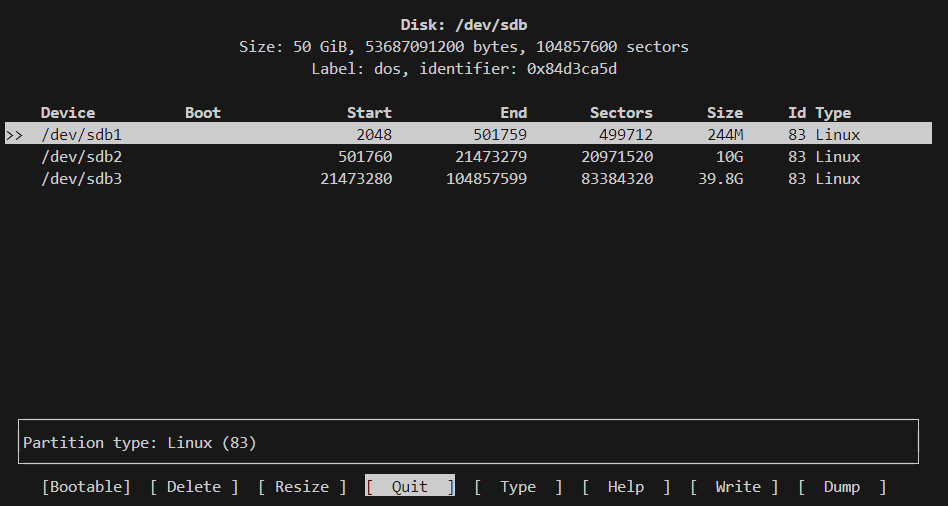

# Linux From Scratch 11.3 再实践

再次失败。

## 1. 准备工作

虚拟机用功能齐全的VMware，宿主机用熟悉的Ubuntu，安装虚拟机时，选择最小安装，给30G全用上，后面再另开一个虚拟硬盘放LFS。

### 1.1. 检查Ubuntu虚拟机的软件环境

```bash
cat > version-check.sh << "EOF"
#!/bin/bash
# Simple script to list version numbers of critical development tools
export LC_ALL=C
bash --version | head -n1 | cut -d" " -f2-4
MYSH=$(readlink -f /bin/sh)
echo "/bin/sh -> $MYSH"
echo $MYSH | grep -q bash || echo "ERROR: /bin/sh does not point to bash"
unset MYSH
echo -n "Binutils: "; ld --version | head -n1 | cut -d" " -f3-
bison --version | head -n1
if [ -h /usr/bin/yacc ]; then
 echo "/usr/bin/yacc -> `readlink -f /usr/bin/yacc`";
elif [ -x /usr/bin/yacc ]; then
 echo yacc is `/usr/bin/yacc --version | head -n1`
else
 echo "yacc not found"
fi
echo -n "Coreutils: "; chown --version | head -n1 | cut -d")" -f2
diff --version | head -n1
find --version | head -n1
gawk --version | head -n1
if [ -h /usr/bin/awk ]; then
 echo "/usr/bin/awk -> `readlink -f /usr/bin/awk`";
elif [ -x /usr/bin/awk ]; then
 echo awk is `/usr/bin/awk --version | head -n1`
else
 echo "awk not found"
fi
gcc --version | head -n1
g++ --version | head -n1
grep --version | head -n1
gzip --version | head -n1
cat /proc/version
m4 --version | head -n1
make --version | head -n1
patch --version | head -n1
echo Perl `perl -V:version`
python3 --version
sed --version | head -n1
tar --version | head -n1
makeinfo --version | head -n1 # texinfo version
xz --version | head -n1
echo 'int main(){}' > dummy.c && g++ -o dummy dummy.c
if [ -x dummy ]
 then echo "g++ compilation OK";
 else echo "g++ compilation failed"; fi
rm -f dummy.c dummy
EOF
bash version-check.sh
```

根据输出解决问题

### 1.2. 创建新的分区

给虚拟机增加一块大小为50G的硬盘，然后使用cfdisk命令去建分区。

```bash
# 新硬盘名为 /dev/sdb
cfdisk /dev/sdb
```

将这块硬盘分三个区，boot，swap，root，如下图所示



### 1.3. 在分区上建立文件系统

```bash
mkfs -v -t ext4 /dev/sdb1
mkfs -v -T small -t ext4 /dev/sdb3
mkswap /dev/sdb2
```

### 1.4. 设置$LFS环境变量

修改需要用到的用户的**bashrc**文件

```bash
vi ~/.bashrc
# 添加
export LFS=/mnt/lfs

source ~/.bashrc
```

### 1.5. 挂载新的分区

挂载的同时并加入fstab

```bash
mkdir -pv $LFS
mount -v -t ext4 /dev/sdb3 $LFS
mkdir -v $LFS/boot
mount -v -t ext4 /dev/sdb1 $LFS/boot
/sbin/swapon -v /dev/sdb2

# vi /etc/fstab
/dev/sdb1       /mnt/lfs/boot   ext4    defaults        1       1
/dev/sdb3       /mnt/lfs        ext4    defaults        1       1
/dev/sdb2       swap    swap    defaults        0       0
```

### 1.6. 下载所需软件包

```bash
mkdir -v $LFS/sources
chmod -v a+wt $LFS/sources

wget --input-file=https://mirrors.ustc.edu.cn/lfs/lfs-packages/11.3/ --continue --directory-prefix=$LFS/sources

pushd $LFS/sources
 md5sum -c md5sums
popd
```

### 1.7. 创建有限目录布局

```bash
mkdir -pv $LFS/{etc,var} $LFS/usr/{bin,lib,sbin}
for i in bin lib sbin; do
 ln -sv usr/$i $LFS/$i
done
case $(uname -m) in
 x86_64) mkdir -pv $LFS/lib64 ;;
esac

mkdir -pv $LFS/tools
```

### 1.8. 添加LFS用户并配置

```bash
groupadd lfs
useradd -s /bin/bash -g lfs -m -k /dev/null lfs

passwd lfs

chown -v lfs $LFS/{usr{,/*},lib,var,etc,bin,sbin,tools}
case $(uname -m) in
 x86_64) chown -v lfs $LFS/lib64 ;;
esac

cat > ~/.bash_profile << "EOF"
exec env -i HOME=$HOME TERM=$TERM PS1='\u:\w\$ ' /bin/bash
EOF

cat > ~/.bashrc << "EOF"
set +h
umask 022
LFS=/mnt/lfs
LC_ALL=POSIX
LFS_TGT=$(uname -m)-lfs-linux-gnu
PATH=/usr/bin
if [ ! -L /bin ]; then PATH=/bin:$PATH; fi
PATH=$LFS/tools/bin:$PATH
CONFIG_SITE=$LFS/usr/share/config.site
export LFS LC_ALL LFS_TGT PATH CONFIG_SITE
EOF

# 切换到root用户
[ ! -e /etc/bash.bashrc ] || mv -v /etc/bash.bashrc /etc/bash.bashrc.NOUSE

# 切换到lfs用户
source ~/.bash_profile
```

用Vmware拍个快照记录一下

## 2. 编译交叉工具链

在lfs用户下使用上一次的代码

解压与删除啥的就不再赘述了

将所需要用到的压缩包[统一解压](tarcctool.sh)

```bash
tar -xf binutils-2.40.tar.xz
tar -xf gcc-12.2.0.tar.xz
tar -xf linux-6.1.11.tar.xz
tar -xf glibc-2.37.tar.xz
```

注意gcc会用到两次，记得解压两次

接下来就不照搬文档中的代码了

安装Glibc时需要注意一下代码的顺序

## 3. 交叉编译临时工具

仍然以lfs的角色身份进行。

出现错误`error "Assumed value of MB_LEN_MAX wrong"`，查阅LFS官网寻找解决问题，退回到第一次构建gcc。

> This error message usually indicates that limits.h provided by GCC isn't including limits.h from Glibc as it should be.  There is one command as a workaround for limits.h in GCC Pass 1.  Do not forget to run the command.

发现是因为少敲了这一串代码

```bash
cd ..
cat gcc/limitx.h gcc/glimits.h gcc/limity.h > \
  `dirname $($LFS_TGT-gcc -print-libgcc-file-name)`/install-tools/include/limits.h
```

利用快照重新开始。重新开始后一切顺利

## 4. 进⼊ Chroot 并构建其他临时⼯具

此时将用户切换为root。一切按文档操作，部分特殊情况将继续罗列。

无事发生，因为我们有快照，就不用备份了，照常删除无用的东西，然后继续！这次我就不睡觉了，直接通宵做完！

## 5. 安装基本系统软件

先做个快照，然后按照文档继续。文档所列出的错误这里不再赘述。

在编译glibc时，耗时较久，因为时在虚拟机编译，所以多了一个报错，`tst-mutex10`，并不影响。

配置glibc时

```
ln -sfv /usr/share/zoneinfo/Asia/Shanghai /etc/localtime
```

安装tcl时

```
tar -xf tcl8.6.13-src.tar.gz
cd tcl8.6.13
tar -xf ../tcl8.6.13-html.tar.gz --strip-components=1
```

安装gcc时测试

```bash
chown -Rv tester .
su tester -c "PATH=$PATH make -k -j8 check"
```

测试结果与文档提供的[结果](https://www.linuxfromscratch.org/lfs/build-logs/11.3/AMD3900X/test-logs/824-gcc-12.2.0)别无二致

安装sed时测试

```bash
chown -Rv tester .
su tester -c "PATH=$PATH make -j8 check"
```

安装intltool时

```bash
make install
install -v -Dm644 doc/I18N-HOWTO /usr/share/doc/intltool-0.51.0/I18N-HOWTO
```

安装ninja时

```bash
install -vm755 ninja /usr/bin/
install -vDm644 misc/bash-completion /usr/share/bash-completion/completions/ninja
install -vDm644 misc/zsh-completion  /usr/share/zsh/site-functions/_ninja
```

安装meson时

```bash
pip3 install --no-index --find-links dist meson
install -vDm644 data/shell-completions/bash/meson /usr/share/bash-completion/completions/meson
install -vDm644 data/shell-completions/zsh/_meson /usr/share/zsh/site-functions/_meson
```

安装findutils时

```bash
chown -Rv tester .
su tester -c "PATH=$PATH make -j8 check"
```

安装groff时

```bash
PAGE=A4 ./configure --prefix=/usr
```

安装grub时

```bash
make install
mv -v /etc/bash_completion.d/grub /usr/share/bash-completion/completions
```

安装ninja时

```bash
tar -xf ../../systemd-man-pages-252-2.tar.xz --strip-components=1 -C /usr/share/man
```

安装utils-linux时

```bash
chown -Rv tester .
su tester -c "make -k -j8 check"
```

安装E2fsprogs时，出现`Tests failed: m_assume_storage_prezeroed`，在文档中已列出的与之错误不同，在[另一版本文档](https://linuxfromscratch.org/~xry111/lfs/view/clfs-ng/chapter08/e2fsprogs.html)中与之相同，那就做个快照略过。

```bash
gunzip -v /usr/share/info/libext2fs.info.gz
install-info --dir-file=/usr/share/info/dir /usr/share/info/libext2fs.info

makeinfo -o      doc/com_err.info ../lib/et/com_err.texinfo
install -v -m644 doc/com_err.info /usr/share/info
install-info --dir-file=/usr/share/info/dir /usr/share/info/com_err.info
```

移除调试符号

```bash
save_usrlib="$(cd /usr/lib; ls ld-linux*[^g])
             libc.so.6
             libthread_db.so.1
             libquadmath.so.0.0.0
             libstdc++.so.6.0.30
             libitm.so.1.0.0
             libatomic.so.1.2.0"

cd /usr/lib

for LIB in $save_usrlib; do
    objcopy --only-keep-debug $LIB $LIB.dbg
    cp $LIB /tmp/$LIB
    strip --strip-unneeded /tmp/$LIB
    objcopy --add-gnu-debuglink=$LIB.dbg /tmp/$LIB
    install -vm755 /tmp/$LIB /usr/lib
    rm /tmp/$LIB
done

online_usrbin="bash find strip"
online_usrlib="libbfd-2.40.so
               libsframe.so.0.0.0
               libhistory.so.8.2
               libncursesw.so.6.4
               libm.so.6
               libreadline.so.8.2
               libz.so.1.2.13
               $(cd /usr/lib; find libnss*.so* -type f)"

for BIN in $online_usrbin; do
    cp /usr/bin/$BIN /tmp/$BIN
    strip --strip-unneeded /tmp/$BIN
    install -vm755 /tmp/$BIN /usr/bin
    rm /tmp/$BIN
done

for LIB in $online_usrlib; do
    cp /usr/lib/$LIB /tmp/$LIB
    strip --strip-unneeded /tmp/$LIB
    install -vm755 /tmp/$LIB /usr/lib
    rm /tmp/$LIB
done

for i in $(find /usr/lib -type f -name \*.so* ! -name \*dbg) \
         $(find /usr/lib -type f -name \*.a)                 \
         $(find /usr/{bin,sbin,libexec} -type f); do
    case "$online_usrbin $online_usrlib $save_usrlib" in
        *$(basename $i)* )
            ;;
        * ) strip --strip-unneeded $i
            ;;
    esac
done

unset BIN LIB save_usrlib online_usrbin online_usrlib
```

最后删除多余的东西

## 6. 系统配置

静态IP配置

```bash
cat > /etc/systemd/network/10-eth-static.network << "EOF"
[Match]
Name=eth0
[Network]
Address=192.168.0.2/24
Gateway=192.168.0.1
DNS=192.168.0.1
EOF
```

dhcp配置

```bash
cat > /etc/systemd/network/10-eth-dhcp.network << "EOF"
[Match]
Name=eth0
[Network]
DHCP=ipv4
[DHCPv4]
UseDomains=true
EOF
```

静态resolv,conf配置

```bash
cat > /etc/resolv.conf << "EOF"
# Begin /etc/resolv.conf
nameserver 114.114.114.114
nameserver 8.8.8.8
# End /etc/resolv.conf
EOF
```

配置系统主机名

```bash
echo "lfs11-3" > /etc/hostname
```

配置系统locale

```bash
LC_ALL=en_US.utf8 locale charmap

LC_ALL=en_US.utf8 locale language
LC_ALL=en_US.utf8 locale charmap
LC_ALL=en_US.utf8 locale int_curr_symbol
LC_ALL=en_US.utf8 locale int_prefix

cat > /etc/locale.conf << "EOF"
LANG=en_US.utf8<@modifiers>
EOF
```

其他无个性的配置省略

## 7. 使LFS系统可引导

创建/etc/fstab文件，用UUID替换/etc/xxx

```
cat > /etc/fstab << "EOF"
# Begin /etc/fstab
# ⽂件系统 挂载点 类型 选项 转储 检查
# 顺序
# sdb3 is the root
UUID=6267cef5-ae9a-4b29-a2bd-006074a45d57	/	ext4	defaults	1	1
# sdb1 is the boot
UUID=5f9dc368-0e0a-462f-bc35-9c01bd381bee	/boot	ext4	deaults,noauto	0	2
# sdb2 is the swap
UUID=e1c6134b-546c-4a42-b38b-588851df27e2	swap	swap	pri=1	0	0
# End /etc/fstab
EOF
```

中间省略

创建grub配置文件

```bash
cat > /boot/grub/grub.cfg << "EOF"
# Begin /boot/grub/grub.cfg
set default=0
set timeout=5
insmod ext2
set root=(hd0,1)
menuentry "GNU/Linux, Linux 6.1.11-lfs-11.3-systemd" {
 linux /vmlinuz-6.1.11-lfs-11.3-systemd root=/dev/sda3 ro
}
EOF
```

## 8. 收尾工作

```bash
cat > /etc/lsb-release << "EOF"
DISTRIB_ID="Linux From Scratch"
DISTRIB_RELEASE="11.3-systemd"
DISTRIB_CODENAME="Parline"
DISTRIB_DESCRIPTION="Linux From Scratch"
EOF
```

```bash
cat > /etc/os-release << "EOF"
NAME="Linux From Scratch"
VERSION="11.3-systemd"
ID=lfs
PRETTY_NAME="Linux From Scratch 11.3-systemd"
VERSION_CODENAME="Parline"
EOF
```

检查一遍配置文件，有些没有有些有，先不管了，关机更换硬盘顺序直接验证。

## 9. 关机重启

关机，然后配置虚拟机

将lfs所在硬盘切换为scsi 0:0

Ubuntu宿主机所在硬盘切换为 0:1

启动。卡在booting the kernel。寻求解决方案中。
